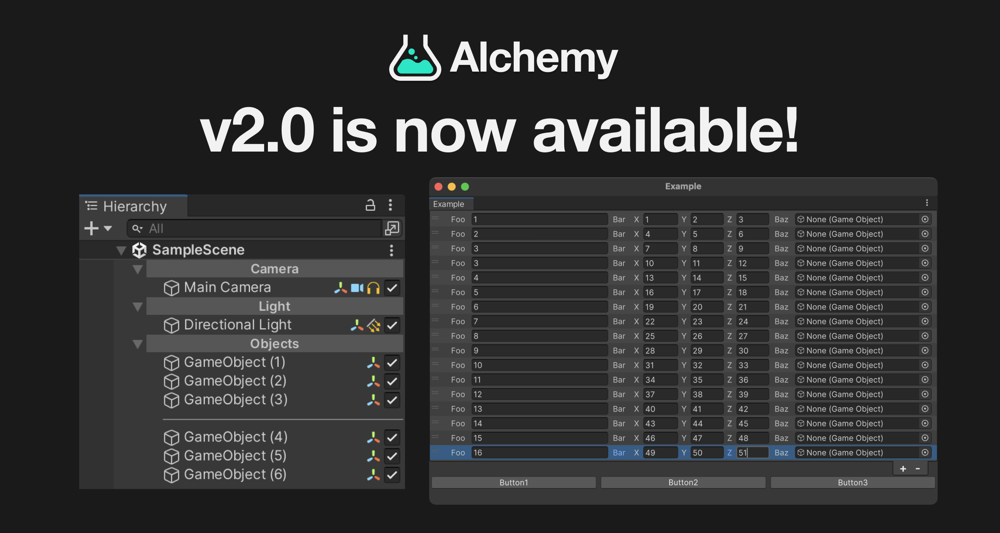

# Alchemy Overview

Alchemy is a library that provides a rich set of editor extensions for Unity. By integrating Alchemy, over 30 attributes are added to easily extend the Inspector. Additionally, by utilizing the Unity.Serialization package and a dedicated Source Generator, it becomes possible to serialize and edit types not normally serializable in Unity (`Dictionary`, `HashSet`, `Nullable`, `ValueTuple`, etc.) directly from the Inspector.

Furthermore, version 2.0 introduces new features such as EditorWindow extensions and Hierarchy extensions. These enable the easy creation of tools to streamline the development workflow within the editor.