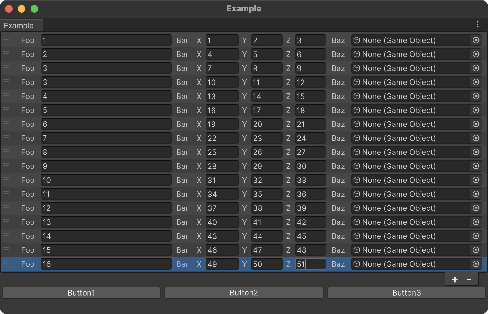

# AlchemyEditorWindow

By inheriting from `AlchemyEditorWindow` instead of `EditorWindow`, you can create editor windows using Alchemy attributes.

```cs
using System;
using System.Collections.Generic;
using UnityEditor;
using UnityEngine;
using UnityEngine.UIElements;
using Alchemy.Editor;
using Alchemy.Inspector;

public class EditorWindowExample : AlchemyEditorWindow
{
    [MenuItem("Window/Example")]
    static void Open()
    {
        var window = GetWindow<EditorWindowExample>("Example");
        window.Show();
    }
    
    [Serializable]
    [HorizontalGroup]
    public class DatabaseItem
    {
        [LabelWidth(30f)]
        public float foo;

        [LabelWidth(30f)]
        public Vector3 bar;
        
        [LabelWidth(30f)]
        public GameObject baz;
    }

    [ListViewSettings(ShowAlternatingRowBackgrounds = AlternatingRowBackground.All, ShowFoldoutHeader = false)]
    public List<DatabaseItem> items;

    [Button, HorizontalGroup]
    public void Button1() { }

    [Button, HorizontalGroup]
    public void Button2() { }

    [Button, HorizontalGroup]
    public void Button3() { }
}
```



Data from windows created by inheriting `AlchemyEditorWindow` is saved in JSON format in the ProjectSettings folder of the project. For more details, refer to the [Saving Editor Window Data](saving-editor-window-data.md) page.