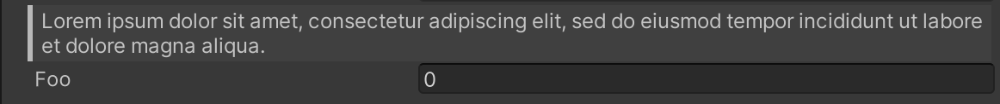

# Blockquote Attribute

Displays a quotation in the Inspector.



```cs
[Blockquote("Lorem ipsum dolor sit amet, consectetur adipiscing elit, sed do eiusmod tempor incididunt ut labore et dolore magna aliqua.")]
public float foo;
```

| Parameter | Description |
| - | - |
| Text | The text to display in the quotation |