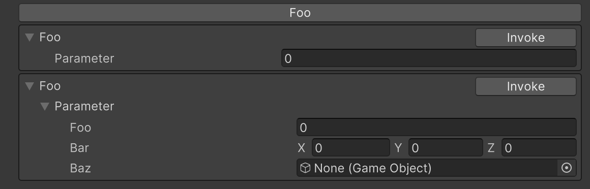

# Button Attribute

Displays a button in the Inspector that can execute a method. If the method has parameters, input fields for those parameters will be added.



```cs
[Button]
public void Foo()
{
    Debug.Log("Foo");
}

[Button]
public void Foo(int parameter)
{
    Debug.Log("Foo: " + parameter);
}

[Button]
public void Foo(SampleClass parameter)
{
    var builder = new StringBuilder();
    builder.AppendLine();
    builder.Append("foo = ").AppendLine(parameter.foo.ToString());
    builder.Append("bar = ").AppendLine(parameter.bar.ToString());
    builder.Append("baz = ").Append(parameter.baz == null ? "Null" : parameter.baz.ToString());
    Debug.Log("Foo: " + builder.ToString());
}
```