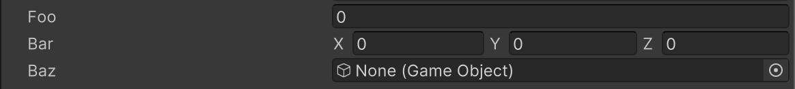

# Disable Alchemy Editor Attribute

Disables the AlchemyEditor for the target class and uses the default Inspector for rendering. When this attribute is added to a field, only that field will be rendered using the default PropertyField.



```cs
[DisableAlchemyEditor]
public class DisableAlchemyEditorExample : MonoBehaviour
{
    public float foo;
    public Vector3 bar;
    public GameObject baz;
}
```