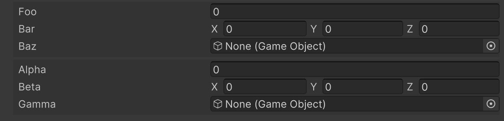

# Group Attribute

Creates a group to display multiple members together.



```cs 
[Group("Group1")]
public float foo;

[Group("Group1")]
public Vector3 bar;

[Group("Group1")]
public GameObject baz;

[Group("Group2")]
public float alpha;

[Group("Group2")]
public Vector3 beta;

[Group("Group2")]
public GameObject gamma;
```

| Parameter | Description |
| - | - |
| GroupPath | Specifies the path of the group. Groups can be nested using `/`. |