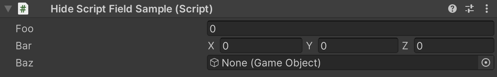

# Hide Script Field Attribute

Hides the target script field.



```cs
[HideScriptField]
public class HideScriptFieldSample : MonoBehaviour
{
    public float foo;
    public Vector3 bar;
    public GameObject baz;
}
```