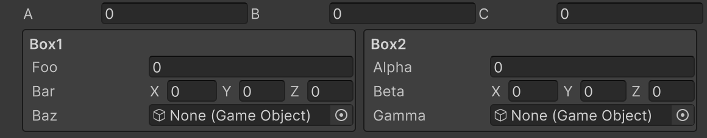

# Horizontal Attribute

Creates a group that displays multiple members horizontally.



```cs 
[HorizontalGroup("Group1")]
public int a;

[HorizontalGroup("Group1")]
public int b;

[HorizontalGroup("Group1")]
public int c;

[HorizontalGroup("Group2")]
[BoxGroup("Group2/Box1")]
public float foo;

[HorizontalGroup("Group2")]
[BoxGroup("Group2/Box1")]
public Vector3 bar;

[HorizontalGroup("Group2")]
[BoxGroup("Group2/Box1")]
public GameObject baz;

[HorizontalGroup("Group2")]
[BoxGroup("Group2/Box2")]
public float alpha;

[HorizontalGroup("Group2")]
[BoxGroup("Group2/Box2")]
public Vector3 beta;

[HorizontalGroup("Group2")]
[BoxGroup("Group2/Box2")]
public GameObject gamma;
```

| Parameter | Description |
| - | - |
| GroupPath | Specifies the path of the group. Groups can be nested using `/`. |