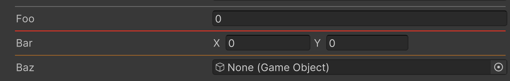

# Horizontal Line Attribute

Adds a horizontal line to the Inspector.



```cs
[HorizontalLine]
public float foo;

[HorizontalLine(1f, 0f, 0f)]
public Vector2 bar;

[HorizontalLine(1f, 0.5f, 0f, 0.5f)]
public GameObject baz;
```

| Parameter | Description |
| - | - |
| r | Red component of the line color |
| g | Green component of the line color |
| b | Blue component of the line color |
| a | Alpha value of the line color |