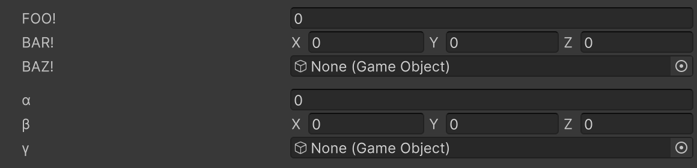

# Label Text Attribute

Overrides the label text of the field.



```cs
[LabelText("FOO!")]
public float foo;

[LabelText("BAR!")]
public Vector3 bar;

[LabelText("BAZ!")]
public GameObject baz;

[Space]
[LabelText("α")]
public float alpha;

[LabelText("β")]
public Vector3 beta;

[LabelText("γ")]
public GameObject gamma;
```

| Parameter | Description |
| - | - |
| Text | The text to display on the field label |