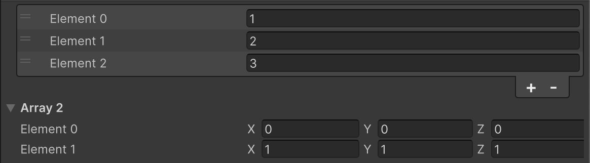

# List View Settings Attribute

Changes the display settings for collections. This attribute allows you to enhance the readability of rows, and create arrays where the element count/order cannot be changed from the Inspector.



```cs 
[ListViewSettings(ShowAlternatingRowBackgrounds = AlternatingRowBackground.All, ShowFoldoutHeader = false)]
public int[] array1;

[ListViewSettings(Reorderable = false, ShowAddRemoveFooter = false, ShowBorder = false, ShowBoundCollectionSize = false)]
public Vector3[] array2 = new Vector3[]
{
    Vector3.zero,
    Vector3.one
};
```

| Parameter | Description |
| - | - |
| ShowAddRemoveFooter | Whether to display the footer for adding/removing elements |
| ShowAlternatingRowBackgrounds | Whether to change the background color for every other row |
| ShowBorder | Whether to display borders |
| ShowBoundCollectionSize | Whether to display the field for changing the number of elements |
| ShowFoldoutHeader | Whether to display the foldout header |
| SelectionType | Selection settings for elements |
| Reorderable | Whether elements can be reordered |
| ReorderMode  | Settings for displaying reordering |