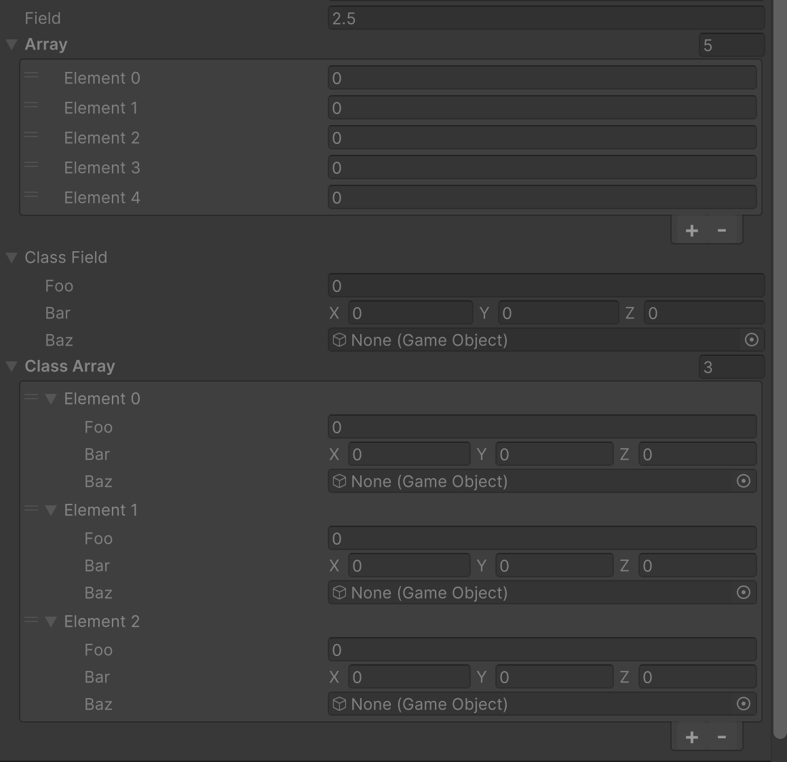

# Read Only Attribute

Makes the field uneditable.



```cs
[ReadOnly]
public float field = 2.5f;

[ReadOnly]
public int[] array = new int[5];

[ReadOnly]
public SampleClass classField;

[ReadOnly]
public SampleClass[] classArray = new SampleClass[3];
```
