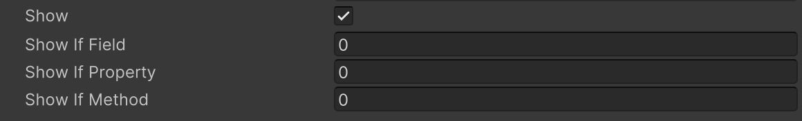

# Show If Attribute

Displays in the Inspector only if the boolean value of the target member is true.




```cs
public bool show;

public bool Show => show;
public bool IsShowTrue() => show;

[ShowIf("show")]
public int showIfField;

[ShowIf("Show")]
public int showIfProperty;

[ShowIf("IsShowTrue")]
public int showIfMethod;
```

| Parameter | Description |
| - | - |
| Condition | The name of the field, property, or method used for condition checking |