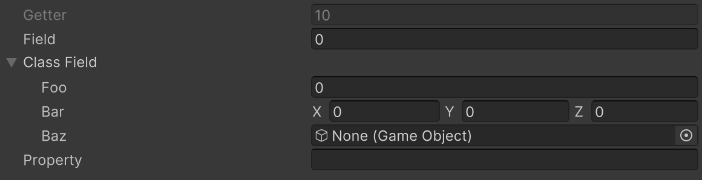

# Show In Inspector Attribute

Allows non-serialized fields or properties to be edited in the Inspector. Note that these values are not serialized, and changes are not saved.



```cs 
[NonSerialized, ShowInInspector]
public int field;

[NonSerialized, ShowInInspector]
public SampleClass classField = new();

[ShowInInspector]
public int Getter => 10;

[field: NonSerialized, ShowInInspector]
public string Property { get; set; } = string.Empty;
```