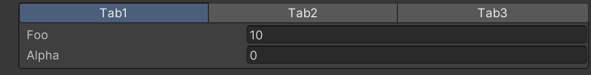

# Tab Group Attribute

Creates a group that divides multiple members into tabs.



```cs 
[TabGroup("Group1", "Tab1")]
public float foo;

[TabGroup("Group1", "Tab2")]
public Vector3 bar;

[TabGroup("Group1", "Tab3")]
public GameObject baz;

[TabGroup("Group1", "Tab1")]
public float alpha;

[TabGroup("Group1", "Tab2")]
public Vector3 beta;

[TabGroup("Group1", "Tab3")]
public GameObject gamma;
```

| Parameter | Description |
| - | - |
| GroupPath | Specifies the path of the group. Groups can be nested using `/`. |
| TabName | Specifies the name of the tab to which the member belongs. |