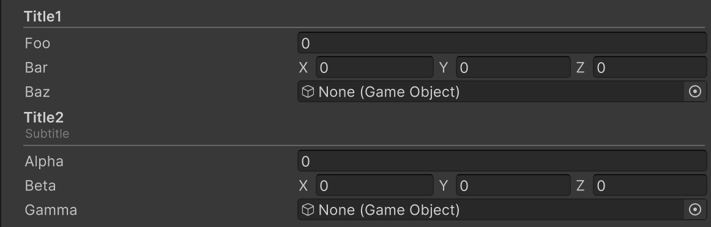

# Title Attribute

Displays a header with a separator line in the Inspector.



```cs
[Title("Title1")]
public float foo;
public Vector3 bar;
public GameObject baz;

[Title("Title2", "Subtitle")]
public float alpha;
public Vector3 beta;
public GameObject gamma;
```

| Parameter | Description |
| - | - |
| Title | Text to display in the header. |
| Subtitle | Text displayed below the title in smaller font. |