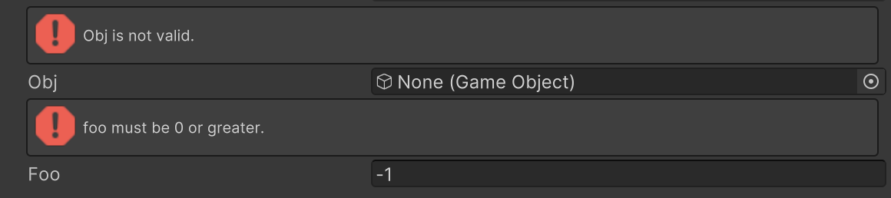

# Validate Input Attribute

Displays a warning if the value of the specified member is false.



```cs 
[ValidateInput("IsNotNull")]
public GameObject obj;

[ValidateInput("IsZeroOrGreater", "foo must be 0 or greater.")]
public int foo = -1;

static bool IsNotNull(GameObject go)
{
    return go != null;
}

static bool IsZeroOrGreater(int a)
{
    return a >= 0;
}
```

| Parameter | Description |
| - | - |
| Condition | Name of the field, property, or method used for validation. |
| Message | Text displayed in the warning. |