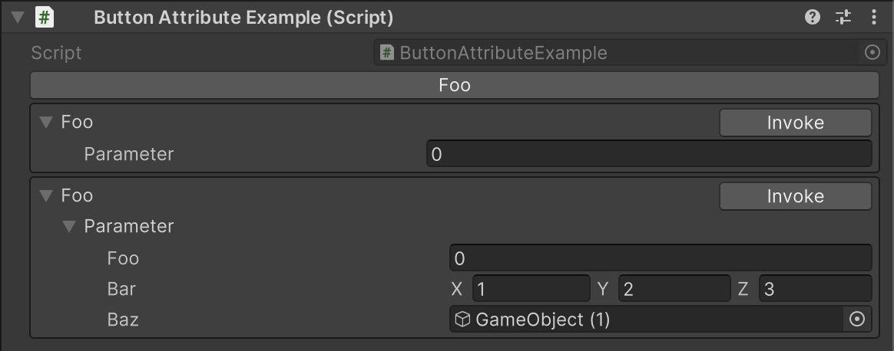

# Button Attribute

By adding the `[Button]` attribute to a method, you can display a button in the Inspector to execute the method.

```cs
using System;
using UnityEngine;
using Alchemy.Inspector;

[Serializable]
public sealed class Example
{
    public float foo;
    public Vector3 bar;
    public GameObject baz;
}

public class ButtonAttributeExample : MonoBehaviour
{
    [Button]
    public void Foo()
    {
        Debug.Log("Foo");
    }

    [Button]
    public void Foo(int parameter)
    {
        Debug.Log("Foo: " + parameter);
    }

    [Button]
    public void Foo(Example parameter)
    {
        var builder = new StringBuilder();
        builder.AppendLine();
        builder.Append("foo = ").AppendLine(parameter.foo.ToString());
        builder.Append("bar = ").AppendLine(parameter.bar.ToString());
        builder.Append("baz = ").Append(parameter.baz == null ? "Null" : parameter.baz.ToString());
        Debug.Log("Foo: " + builder.ToString());
    }
}
```

