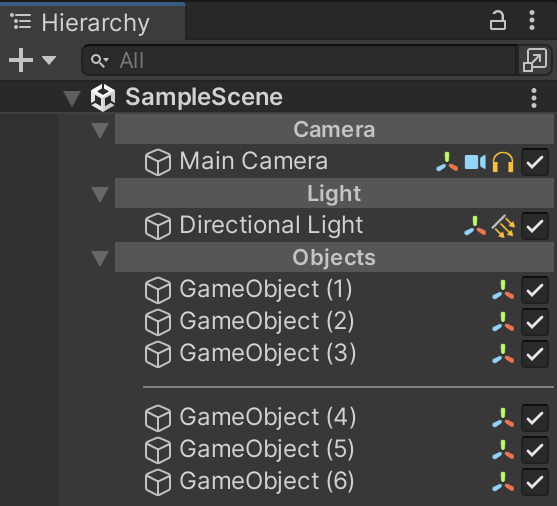
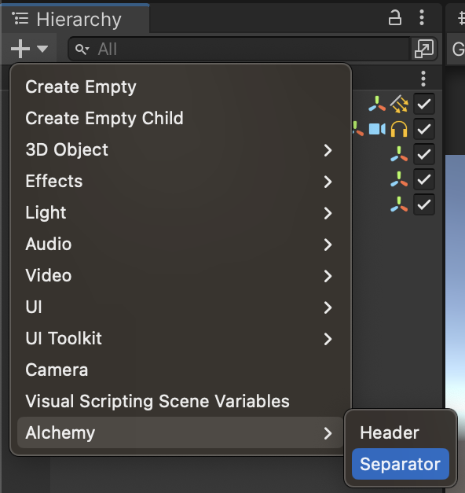
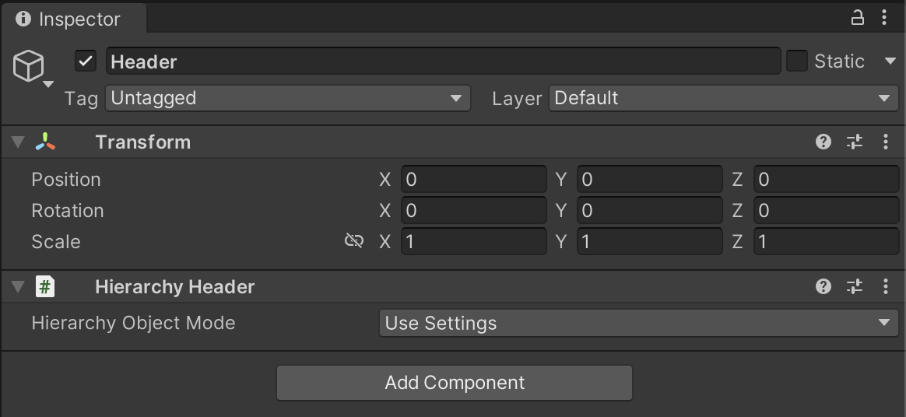

# Decorating Hierarchy

Alchemy allows you to decorate the Hierarchy by adding headers and separators, making it more visually appealing and easier to navigate.

To add headers and separators, navigate to the Hierarchy and click the "+" button, then choose `Alchemy > Header/Separator`.

These objects used for decoration in the Hierarchy are called `HierarchyObjects` in Alchemy. They are excluded from the build process. If any child objects exist, they will be detached using `transform.DetachChildren()` before deletion.

You can configure the handling of `HierarchyObjects` in the Alchemy settings under `Project Settings > Alchemy`.

For individual `HierarchyObjects`, you can adjust their settings from the Inspector.

