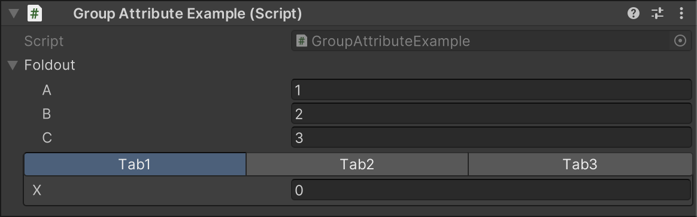
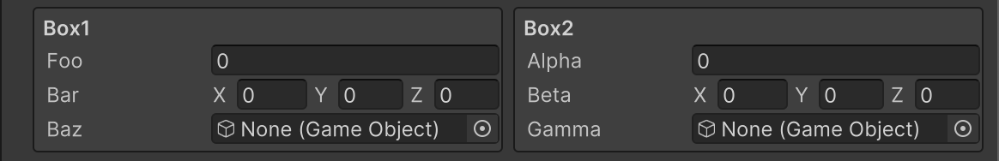
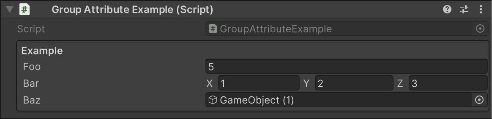

# Group Attributes

Alchemy provides attributes to group fields together.

```cs
using UnityEngine;
using Alchemy.Inspector;

public class GroupAttributesExample : MonoBehaviour
{
    [FoldoutGroup("Foldout")]
    public int a;

    [FoldoutGroup("Foldout")]
    public int b;

    [FoldoutGroup("Foldout")]
    public int c;

    [TabGroup("Tab", "Tab1")]
    public int x;

    [TabGroup("Tab", "Tab2")]
    public string y;

    [TabGroup("Tab", "Tab3")]
    public Vector3 z;
}
```



Each group can be nested by using slashes.

```cs
using UnityEngine;
using Alchemy.Inspector;

public class GroupAttributesExample : MonoBehaviour
{
    [HorizontalGroup("Horizontal"), BoxGroup("Horizontal/Box1")]
    public float foo;

    [HorizontalGroup("Horizontal"), BoxGroup("Horizontal/Box1")]
    public Vector3 bar;

    [HorizontalGroup("Horizontal"), BoxGroup("Horizontal/Box1")]
    public GameObject baz;

    [HorizontalGroup("Horizontal"), BoxGroup("Horizontal/Box2")]
    public float alpha;

    [HorizontalGroup("Horizontal"), BoxGroup("Horizontal/Box2")]
    public Vector3 beta;

    [HorizontalGroup("Horizontal"), BoxGroup("Horizontal/Box2")]
    public GameObject gamma;
}
```



Additionally, you can add group attributes to a defined Serializable class to change how its members are displayed within corresponding groups.

```cs
using System;
using UnityEngine;
using Alchemy.Inspector;

[Serializable]
[BoxGroup]
public sealed class Example
{
    public float foo;
    public Vector3 bar;
    public GameObject baz;
}

public class GroupAttributeExample : MonoBehaviour
{
    public Example example;
}
```

