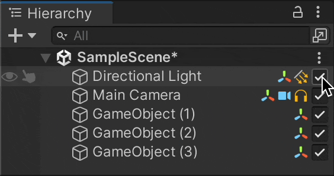
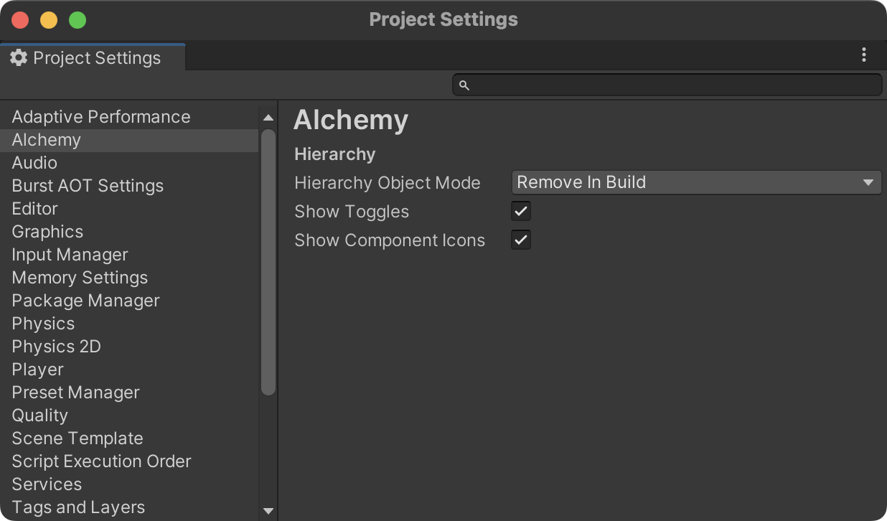

# Toggles and Icons

By integrating Alchemy, you can add toggles to the Hierarchy to switch objects between active and inactive states, as well as icons for each component.

These features are disabled by default. You can configure Hierarchy display settings in `Project Settings > Alchemy`.

