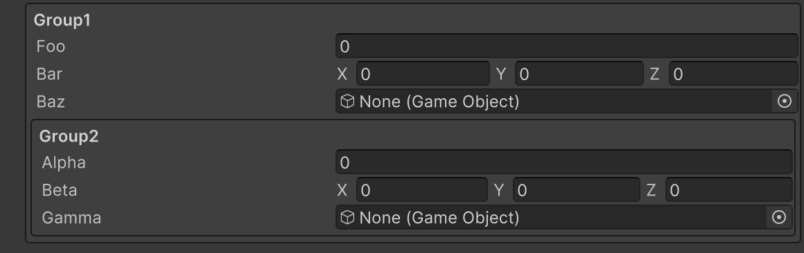

# Box Group Attribute

複数のメンバーをボックスにまとめて表示するグループを作成します。



```cs 
[BoxGroup("Group1")]
public float foo;

[BoxGroup("Group1")]
public Vector3 bar;

[BoxGroup("Group1")]
public GameObject baz;

[BoxGroup("Group1/Group2")]
public float alpha;

[BoxGroup("Group1/Group2")]
public Vector3 beta;

[BoxGroup("Group1/Group2")]
public GameObject gamma;
```

| パラメータ | 説明 |
| - | - |
| GroupPath | グループのパスを指定します。グループは`/`で区切ることでネストすることが可能です。 |
