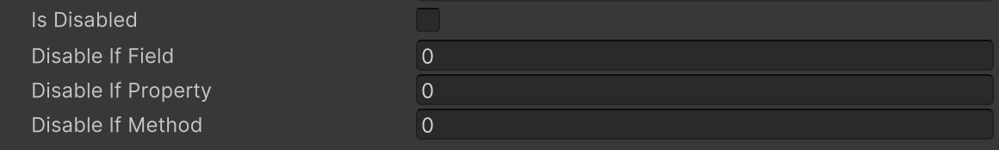
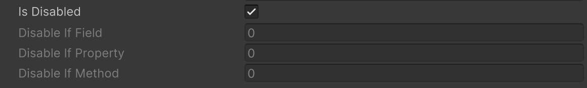

# Disable If Attribute

対象のメンバーのbool値がtrueの場合、フィールドが編集不可能になります。





```cs
public bool isDisabled;

public bool IsDisabled => isDisabled;
public bool IsDisabledMethod() => isDisabled;

[DisableIf("isDisabled")]
public int disableIfField;

[DisableIf("IsDisabled")]
public int disableIfProperty;

[DisableIf("IsDisabledMethod")]
public int disableIfMethod;
```

| パラメータ | 説明 |
| - | - |
| Condition | 条件の判定に使用するフィールド、プロパティまたはメソッドの名前 |
