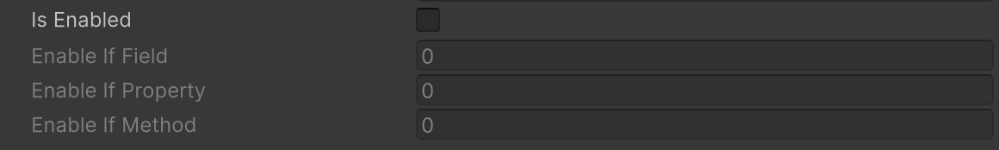

# Enable If Attribute

対象のメンバーのbool値がtrueの場合にのみフィールドを編集可能になります。




```cs
public bool isEnabled;

public bool IsEnabled => isEnabled;
public bool IsEnabledMethod() => isEnabled;

[EnableIf("isEnabled")]
public int enableIfField;

[EnableIf("IsEnabled")]
public int enableIfProperty;

[EnableIf("IsEnabledMethod")]
public int enableIfMethod;
```

| パラメータ | 説明 |
| - | - |
| Condition | 条件の判定に使用するフィールド、プロパティまたはメソッドの名前 |
