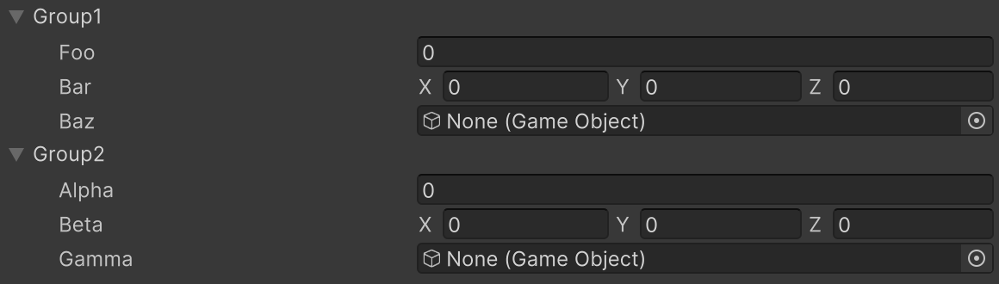

# Foldout Group Attribute

複数のメンバーを折りたたみ可能なグループを作成します。



```cs 
[FoldoutGroup("Group1")]
public float foo;

[FoldoutGroup("Group1")]
public Vector3 bar;

[FoldoutGroup("Group1")]
public GameObject baz;

[FoldoutGroup("Group2")] 
public float alpha;

[FoldoutGroup("Group2")]
public Vector3 beta;

[FoldoutGroup("Group2")]
public GameObject gamma;
```

| パラメータ | 説明 |
| - | - |
| GroupPath | グループのパスを指定します。グループは`/`で区切ることでネストすることが可能です。 |
