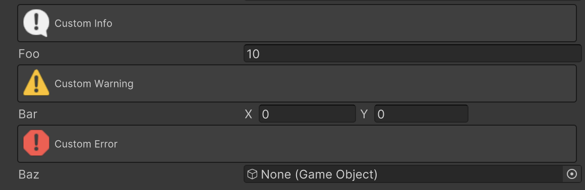

# Help Box Attribute

フィールドの上にメモや警告を追加します。



```cs
[HelpBox("Custom Info")]
public float foo;

[HelpBox("Custom Warning", HelpBoxMessageType.Warning)]
public Vector2 bar;

[HelpBox("Custom Error", HelpBoxMessageType.Error)]
public GameObject baz;
```

| パラメータ | 説明 |
| - | - |
| Message | ボックス内に表示するテキスト |
| MessageType | メッセージの種類 |