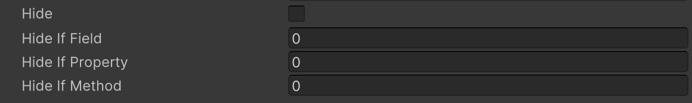

# Hide If Attribute

対象のメンバーのbool値がtrueの場合はInspectorに表示されなくなります。




```cs
public bool hide;

public bool Hide => hide;
public bool IsHideTrue() => hide;

[HideIf("hide")]
public int hideIfField;

[HideIf("Hide")]
public int hideIfProperty;

[HideIf("IsHideTrue")]
public int hideIfMethod;
```


| パラメータ | 説明 |
| - | - |
| Condition | 条件の判定に使用するフィールド、プロパティまたはメソッドの名前 |
