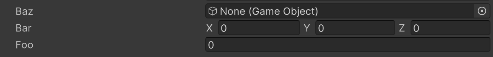

# Order Attribute

フィールドの表示順を変更します。Orderのデフォルト値は0で、メンバーは昇順に表示されます。



```cs
[Order(2)]
public float foo;

[Order(1)]
public Vector3 bar;

[Order(0)]
public GameObject baz;
```

| パラメータ | 説明 |
| - | - |
| Order | メンバーの表示順 |
