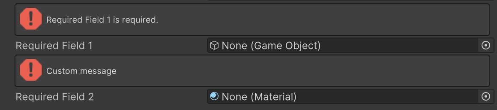

# Required Attribute

フィールドにオブジェクトの参照が割り当てられていない場合に警告を表示します。



```cs 
[Required]
public GameObject requiredField1;

[Required("Custom message")]
public Material requiredField2;
```

| パラメータ | 説明 |
| - | - |
| Message | 警告に表示するテキスト |