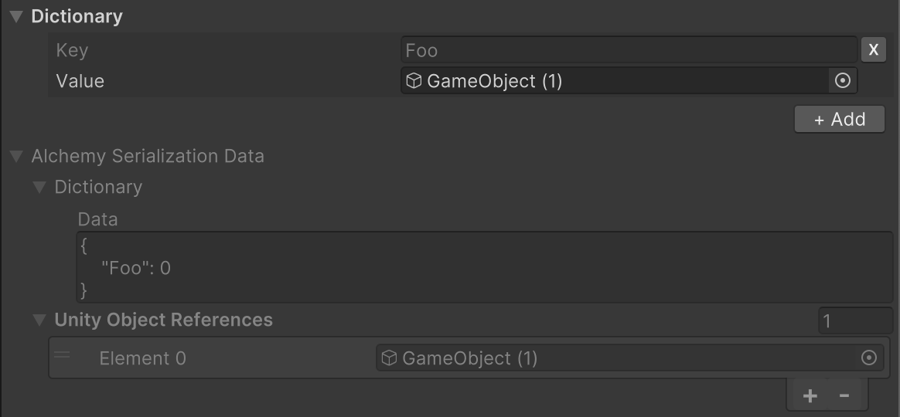

# シリアル化データのデバッグ

`[AlchemySerialize]`と同時に`[ShowAlchemySerializationData]`属性を付加することで、Inspector上からシリアル化されたデータを確認することができるようになります。

```cs
using System;
using System.Collections.Generic;
using UnityEngine;
using Alchemy.Serialization;

[AlchemySerialize]
[ShowAlchemySerializationData]
public partial class AlchemySerializationExample : MonoBehaviour
{
    [AlchemySerializeField, NonSerialized]
    public Dictionary<string, GameObject> dictionary = new();
}
```



