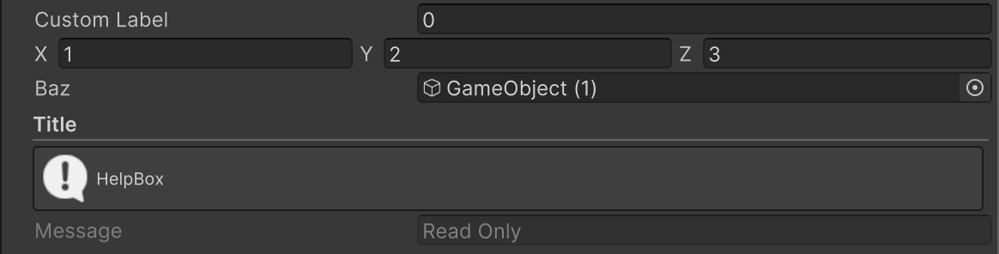

# 属性を用いたInspector拡張

Alchemyでは属性を用いてInspectorを拡張することが可能です。Inspectorの表示をカスタマイズしたい場合には、クラスが持つフィールドに属性を付加します。

```cs
using UnityEngine;
using UnityEngine.UIElements;
using Alchemy.Inspector;  // Alchemy.Inspector名前空間をusingに追加

public class AttributesExample : MonoBehaviour
{
    [LabelText("Custom Label")]
    public float foo;

    [HideLabel]
    public Vector3 bar;
    
    [AssetsOnly]
    public GameObject baz;

    [Title("Title")]
    [HelpBox("HelpBox", HelpBoxMessageType.Info)]
    [ReadOnly]
    public string message = "Read Only";
}
```


