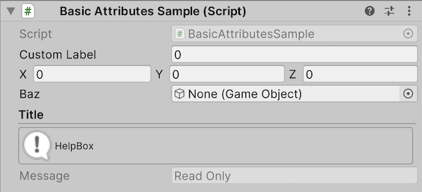
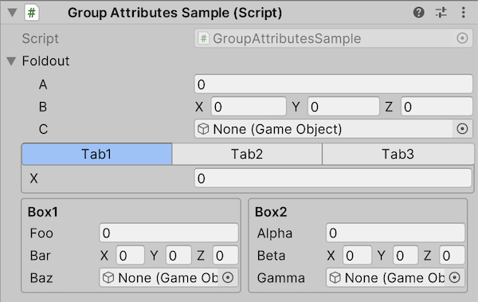
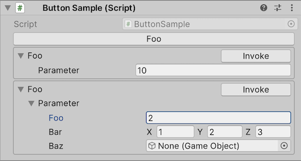

# クイックスタート

Inspectorでの表示をカスタマイズしたい場合には、クラスが持つフィールドに属性を付加します。

```cs
using UnityEngine;
using UnityEngine.UIElements;
using Alchemy.Inspector;  // Alchemy.Inspector名前空間をusingに追加

public class BasicAttributesSample : MonoBehaviour
{
    [LabelText("Custom Label")]
    public float foo;

    [HideLabel]
    public Vector3 bar;
    
    [AssetsOnly]
    public GameObject baz;

    [Title("Title")]
    [HelpBox("HelpBox", HelpBoxMessageType.Info)]
    [ReadOnly]
    public string message = "Read Only";
}
```



各フィールドをグループ化する属性もいくつか用意されています。各グループはスラッシュで区切ることでネストできます。

```cs
using UnityEngine;
using Alchemy.Inspector;

public class GroupAttributesSample : MonoBehaviour
{
    [FoldoutGroup("Foldout")] public int a;
    [FoldoutGroup("Foldout")] public int b;
    [FoldoutGroup("Foldout")] public int c;

    [TabGroup("Tab", "Tab1")] public int x;
    [TabGroup("Tab", "Tab2")] public string y;
    [TabGroup("Tab", "Tab3")] public Vector3 z;

    [HorizontalGroup("Horizontal")][BoxGroup("Horizontal/Box1")] public float foo;
    [HorizontalGroup("Horizontal")][BoxGroup("Horizontal/Box1")] public Vector3 bar;
    [HorizontalGroup("Horizontal")][BoxGroup("Horizontal/Box1")] public GameObject baz;

    [HorizontalGroup("Horizontal")][BoxGroup("Horizontal/Box2")] public float alpha;
    [HorizontalGroup("Horizontal")][BoxGroup("Horizontal/Box2")] public Vector3 beta;
    [HorizontalGroup("Horizontal")][BoxGroup("Horizontal/Box2")] public GameObject gamma;
}
```



メソッドに`[Button]`属性を付加することで、メソッドをInspectorから実行することが可能になります。

```cs
using System.Text;
using UnityEngine;
using Alchemy.Inspector;

[Serializable]
public sealed class SampleClass : ISample
{
    public float foo;
    public Vector3 bar;
    public GameObject baz;
}

public class ButtonSample : MonoBehaviour
{
    [Button]
    public void Foo()
    {
        Debug.Log("Foo");
    }

    [Button]
    public void Foo(int parameter)
    {
        Debug.Log("Foo: " + parameter);
    }

    [Button]
    public void Foo(SampleClass parameter)
    {
        var builder = new StringBuilder();
        builder.AppendLine();
        builder.Append("foo = ").AppendLine(parameter.foo.ToString());
        builder.Append("bar = ").AppendLine(parameter.bar.ToString());
        builder.Append("baz = ").Append(parameter.baz == null ? "Null" : parameter.baz.ToString());
        Debug.Log("Foo: " + builder.ToString());
    }
}
```


