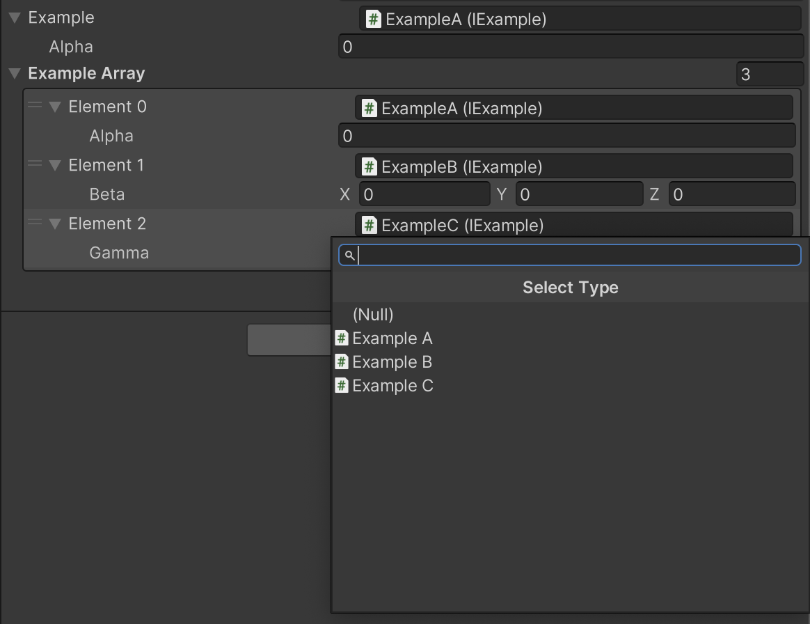

# SerializeReference

AlchemyはUnityの`[SerializeReference]`に対応しています。`[SerializeReference]`属性を付加することで、インターフェースや抽象クラスをInspector上で編集できるようになります。

```cs
using System;
using UnityEngine;

public interface IExample { }

[Serializable]
public sealed class ExampleA : IExample
{
    public float alpha;
}

[Serializable]
public sealed class ExampleB : IExample
{
    public Vector3 beta;
}

[Serializable]
public sealed class ExampleC : IExample
{
    public GameObject gamma;
}

public class SerializeReferenceExample : MonoBehaviour
{
    [SerializeReference] public IExample example;
    [SerializeReference] public IExample[] exampleArray;
}
```



インターフェース・抽象クラスは上のように表示され、ドロップダウンから子クラスを選択して生成することができます。

SerializeReferenceのシリアル化については[Unityの公式マニュアル](https://docs.unity3d.com/ja/2020.3/ScriptReference/SerializeReference.html)を参照してください。